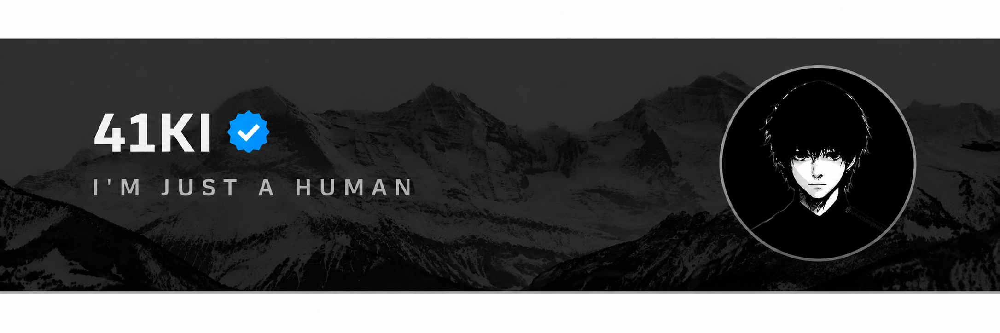

<h1 align="center">
    
</h1>

> [!NOTE]
> I’m currently developing for **[Portifolio](https://41ki.vercel.app)**

## Let's Connects~

- **[X](https://x.com/)**
- **[Instagram](https://instagram.com/)**
- **[Discord Server](https://discord.gg/)**

Email notification only from **[???](???)**

---

<picture>
  
</picture>
